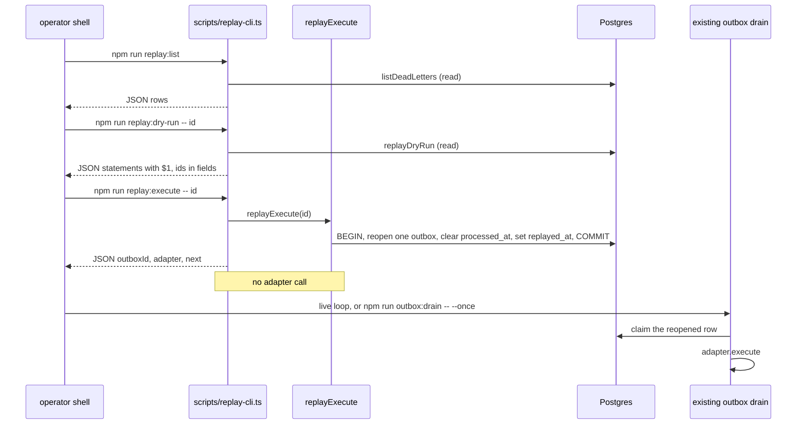

> **Historical note (pre-go-live).** This document records the replay-CLI design pass of 2026-09-26. As of 2026-09-27 the Polar listing is live and sells `hooksteel-0.1.1.zip` (SHA-256 `e5fb3c1117b954f344fb27e7b1bf7be89d46e120839e238983d017a50e08e4d9`). https://github.com/yellowgram/hooksteel is public and source-available. GitHub Release `v0.1.1` is published. Sentences below that say the listing stays dark, do not publish, or the repo is private describe that pass. They are not current commercial status. Soft-WTP stays off. Purchase-refund window stays 14 days. This note does not change Polar settings.

# HookSteel — DESIGN: replay CLI

**Owner:** yellowgram  
**Product:** HookSteel — Billing Event Reliability Kit  
**Slice:** Three `npm run` commands that list dead letters, dry-run one id, and execute one id. They call the shipped `listDeadLetters`, `replayDryRun`, and `replayExecute`. Then the existing drain runs the adapter.  
**Base:** `main` @ `09c4f88d21dae3fc01af6cae27456246b898626c` (Polar path merged, PR #3). Stripe path, Polar verify / `handlePolar`, outbox, drain, replay mutation, five chaos files, and LICENSE stay.  
**Repo:** https://github.com/yellowgram/hooksteel  
**This pass:** **Design only.** No application code. No scripts. Soft-WTP OFF. The Polar listing was still dark on this pass. No Lock/Audit/services. No hosted gateway.  
**Purchase-refund window (current policy):** **14 days**, founder lock 2026-09-26. See [`REFUND_GLOSSARY.md`](./REFUND_GLOSSARY.md). This replay-CLI slice did not choose that number. Replay is not that refund. `order.refunded` does not claw back credit. At this design pass the listing was still dark; the historical note at the top is the current commercial status.  
**Standing practice:** 3 progressive adversarial **design** iterations in §2. **Founder GREENLIT** 2026-09-26. PQ1 and PQ2 are locked in §3. RD1 and RD2 stay known limits for the implement README. **Implement is a separate later PR** — not this design change.  
**Date:** 2026-09-26 ET  
**Evidence read that day:** `src/outbox/replay.ts`, `scripts/outbox-drain.ts`, `migrations/003_dead_letters.sql`, `migrations/004_dead_letters_outbox_unique.sql`, `tests/unit/drain.test.ts`, `package.json` scripts, README drain paragraph, `DESIGN_STRIPE_PATH.md` §1.9, `COS_CODE_REVIEW_PR1.yaml` CR2-A-P2-002, `MINIMUM_SUPPORT_CHECKLIST.md` §C.18 and §G, `MVP_SCOPE.md` replay responsibilities.

---

## (0) Slice lock (what implement may build later)

| In this slice | Out of this slice |
| --- | --- |
| `scripts/replay-cli.ts` — dotenv, argv parse, call the three existing functions, print, `closePool` | Any edit to `src/outbox/replay.ts`, `src/outbox/drain.ts`, `src/webhooks/**`, `src/adapters/**`, `migrations/**`, `src/index.ts` |
| `package.json` **scripts only:** `replay:list`, `replay:dry-run`, `replay:execute` | A `bin` entry, a new dependency, `yargs` / `commander`, a global `hooksteel-replay` |
| `tests/unit/replay-cli.test.ts` — argv only, no Postgres | A sixth chaos file, or edits to `tests/chaos/01`–`05` |
| README + `BUYER_START_HERE.md` runbook: inspect → dry-run → execute → drain runs the adapter | Worker UI, Grafana, a hosted drain, a drain spawned by execute |
| Glossary sentence: replay ≠ Polar purchase refund | Picking the number was outside this slice. Current policy is **14 days** ([`REFUND_GLOSSARY.md`](./REFUND_GLOSSARY.md)). `order.refunded` clawback, Polar listing, and KYC stay out. |
| One known-limit sentence for CR2-A-P2-002 (deferred, not fixed) | Relabeling `$1` inside `statementsFor`, or adding a billing-event id field to `ReplayDryRun` |
| `docs/STATUS.md` on the **implement** PR, after greenlight, to record that implement | CR3 P2s (published MAC pin, Stripe label on the first HTTP table), LICENSE Polar-org clause, zip / checksum / landing / 60s demo |

**Mutation is already shipped.** `replayExecute` reopens one outbox row and sets `dead_letters.replayed_at`. It does not call the adapter. This slice does not add a second mutation.

---

## (1) Final design (post–design×3)

§1 is the lock after the three iterations in §2. Implement from §1, not from an earlier iteration’s rejected sketch, and not from the four-verb `hooksteel-replay` sketch in `DESIGN_STRIPE_PATH.md` §1.9. That section’s **mutation** still holds. Its **command spelling** is superseded here (see PQ1).

### 1.1 Commands (locked)

Same runner as `outbox:drain`: `tsx` on a script, `dotenv.config()`, then the existing pool. No new env var. `DATABASE_URL` stays required because `getPool()` throws without it. No `REPLAY_FORCE`, no operator name, no `--yes`.

`package.json` gains three scripts and nothing else:

```json
"replay:list": "tsx scripts/replay-cli.ts list",
"replay:dry-run": "tsx scripts/replay-cli.ts dry-run",
"replay:execute": "tsx scripts/replay-cli.ts execute"
```

Operator commands (npm needs `--` before the id):

```bash
npm run replay:list
npm run replay:dry-run -- <dead_letter_id>
npm run replay:execute -- <dead_letter_id>
npm run outbox:drain -- --once
```

| Command | Calls | Writes? | Adapter? |
| --- | --- | --- | --- |
| `replay:list` | `listDeadLetters()` | No | No |
| `replay:dry-run` | `replayDryRun(id)` | No | No |
| `replay:execute` | `replayExecute(id)` | Yes, the shipped transaction only | No |
| `outbox:drain` | existing `drainOnce` | Yes, existing claim/complete | Yes |

Imports in the script match `scripts/outbox-drain.ts`: relative `../src/outbox/replay.js` and `../src/db/pool.js`. Do not import the package name `hooksteel` (that resolves to `dist/`). Do not import `src/chaos`. The layout test walks `scripts/` and rejects a chaos import.

There is no fourth command. `replay:list` **is** the inspect step. `DESIGN_STRIPE_PATH.md` §1.9 named `hooksteel-replay inspect <id>`. This slice does not add it. An inspect that loaded `payload_snapshot` would be a new query and would print PII the list function does not return.

### 1.2 What the three functions already do (do not rewrite)

Evidence: `src/outbox/replay.ts` at `09c4f88`.

**`listDeadLetters()`** returns every row, oldest `failed_at` first, including rows whose `replayed_at` is set:

```text
SELECT d.id, d.reason, o.adapter, d.replayed_at
FROM dead_letters d
LEFT JOIN outbox o ON o.id = d.outbox_id
ORDER BY d.failed_at ASC
```

Fields: `id`, `reason`, `adapter` (nullable when the outbox row is gone), `replayed_at` (nullable). No `payload_snapshot`, no billing-event id, no `failed_at` in the result (ordering uses `failed_at`; the value is not returned).

**`replayDryRun(id)`** reads with the same joins as execute, then returns:

```text
{ deadLetterId, adapter, outboxId, statements }
```

`statements` is exactly these three strings. Ids are **not** interpolated. Each statement’s `$1` is a different row:

```text
UPDATE outbox SET completed_at = NULL, last_error = NULL, available_at = now(), locked_at = NULL, locked_by = NULL, attempts = 0 WHERE id = $1
UPDATE billing_events SET processed_at = NULL WHERE id = $1
UPDATE dead_letters SET replayed_at = now() WHERE id = $1 AND replayed_at IS NULL
```

| Statement | `$1` binds | Returned on `ReplayDryRun`? |
| --- | --- | --- |
| 1 `UPDATE outbox` | outbox id | Yes — `outboxId` |
| 2 `UPDATE billing_events` | billing event id | **No field** |
| 3 `UPDATE dead_letters` | dead letter id | Yes — `deadLetterId` |

**CR2-A-P2-002 stays deferred.** The finding (`COS_CODE_REVIEW_PR1.yaml`): dry-run SQL uses `$1` for two different rows; change requested was to label which `$1` is the outbox vs the dead letter, in `src/outbox/replay.ts`. This slice does not edit that file, does not rewrite the three strings, and does not add `billingEventId` to `ReplayDryRun`. The separate fields above are the shipped shape. Implement README records the deferral (§1.6). Operators do not paste the statements into `psql` with one bind.

**`replayExecute(id)`** in one transaction:

1. `BEGIN`
2. `SELECT … FOR UPDATE OF d` on that dead letter (same joins)
3. `UPDATE outbox` as in statement 1, bound to `outbox_id`
4. `UPDATE billing_events SET processed_at = NULL` bound to `billing_event_id`
5. `UPDATE dead_letters SET replayed_at = now() WHERE id = $1 AND replayed_at IS NULL` — require `rowCount === 1`
6. `COMMIT`

On any throw, `ROLLBACK` then release the client. Return value is `{ outboxId, adapter }` only. The function does not call `getAdapter`, does not call `drainOnce`, and does not insert a new outbox row. `billing_events.status` is not updated. The idempotency key `provider|provider_event_id|adapter` is not changed.

**Refusals (already thrown as `ReplayRefusedError`).** The CLI prints `error.message` and exits non-zero. It does not reword these strings:

| Condition | Message |
| --- | --- |
| No `dead_letters` row | `dead letter not found` |
| `replayed_at` already set, or the conditional update matches 0 rows | `dead letter already replayed` |
| `billing_event_id` is null, or the billing row does not join | `billing event is missing; refusing replay of an event that never entered billing_events` |
| `outbox_id` is null, or the outbox row does not join | `outbox row is missing` |

Signature-failed and secret-rejected deliveries never insert `billing_events` (HTTP 400, no row). They have no dead letter. There is no CLI input that is a raw body, a `webhook-id`, or a Stripe `evt_` id. Passing an outbox id into dry-run or execute hits `dead letter not found`, because the lookup is `dead_letters.id`. Keep that.

No `--force`. A second execute of the same id is the refusal above. Two concurrent executes: `FOR UPDATE` plus the `replayed_at IS NULL` check means one commit and one `ReplayRefusedError`.

**After a successful execute, drain is what runs the adapter.** `attempts` is reset to 0, `available_at = now()`, locks cleared. A live `npm run outbox:drain` loop can claim that row. `npm run outbox:drain -- --once` is the explicit step when no loop is running. A later failure may insert a **new** open dead letter for the same `outbox_id`: `dead_letters_open_outbox_uidx` is partial on `replayed_at IS NULL`, so the replayed row drops out of the index. The old row stays. The CLI does not delete it.

Sibling adapters on the same billing event are not reopened. Only the dead letter’s outbox row is cleared. `processed_at` is cleared on the parent event. Drain sets it again when no incomplete child remains (shipped `markProcessed`). Replaying `grant_credit` does not re-run `send_email`.

`reason = poison` (unregistered adapter) is replayable. The next claim dead-letters `poison` again on the first claim if the adapter is still missing. Register the adapter before execute, or the new row comes back immediately. The CLI does not add a poison-specific refusal. `timeout` and `adapter_error` remain in the check constraint and this drain still does not write them. The CLI does not start writing them.

`provider` does not matter. A Polar dead letter and a Stripe dead letter use the same three commands.

### 1.3 Process behavior (locked)

One file, `scripts/replay-cli.ts`. It exports `parseReplayArgs` for the unit test. The process body runs only when this file is the entrypoint, so a test import does not open a pool.

`parseReplayArgs(process.argv.slice(2))` accepts only:

| argv | Result |
| --- | --- |
| `['list']` | `{ ok: true, command: 'list' }` |
| `['dry-run', id]` | `{ ok: true, command: 'dry-run', id }` |
| `['execute', id]` | `{ ok: true, command: 'execute', id }` |
| anything else | `{ ok: false, message }` |

`id` is the raw token. No UUID regex (the column lookup already refuses unknown ids). Empty token, a second id, any token starting with `-` (`--force`, `--all`, `--drain`, `--yes`, `--open`), an unknown command, and `list` plus extra tokens are all `{ ok: false }`. The message is one usage line:

```text
usage: replay-cli.ts list | dry-run <dead_letter_id> | execute <dead_letter_id>
```

On `{ ok: false }`: write that line to stderr, exit 1, **do not** call `getPool`.

On success, stdout is one JSON document, `JSON.stringify(value, null, 2)`. No table package. Dates from `pg` become ISO-8601 strings through `JSON.stringify`. `null` stays `null`.

**list**

```json
{
  "command": "list",
  "count": 1,
  "rows": [
    {
      "id": "00000000-0000-4000-8000-000000000001",
      "reason": "max_attempts",
      "adapter": "grant_credit",
      "replayed_at": null
    }
  ]
}
```

`count` is `rows.length`. Zero rows is `count: 0`, `rows: []`, exit 0. Do not filter to `replayed_at IS NULL` in the CLI. The function returns history; hiding it makes a second open letter look like the only failure.

**dry-run** — spread the `ReplayDryRun` object. Do not map, relabel, or concatenate ids into `statements`.

```json
{
  "command": "dry-run",
  "deadLetterId": "00000000-0000-4000-8000-000000000001",
  "adapter": "grant_credit",
  "outboxId": "00000000-0000-4000-8000-000000000002",
  "statements": [
    "UPDATE outbox SET completed_at = NULL, last_error = NULL, available_at = now(), locked_at = NULL, locked_by = NULL, attempts = 0 WHERE id = $1",
    "UPDATE billing_events SET processed_at = NULL WHERE id = $1",
    "UPDATE dead_letters SET replayed_at = now() WHERE id = $1 AND replayed_at IS NULL"
  ]
}
```

**execute** — fields from the return value, plus the argv id, plus a `next` string. `next` is text. The script does not spawn it.

```json
{
  "command": "execute",
  "deadLetterId": "00000000-0000-4000-8000-000000000001",
  "outboxId": "00000000-0000-4000-8000-000000000002",
  "adapter": "grant_credit",
  "next": "npm run outbox:drain -- --once"
}
```

`ReplayRefusedError` and any other throw (including `DATABASE_URL is required`): stderr gets `error.message` only, no stack, exit 1. `closePool()` runs on both the success path and the failure path before the process ends, same shutdown intent as `scripts/outbox-drain.ts`.

No interactive prompt. Dry-run is the confirmation step. Execute of one id is the write.

### 1.4 What execute changes, and what drain does next



Operator order is fixed: list, then dry-run that id, then execute that same id, then drain. Execute does not imply the adapter has run. `adapter_invocations` (test-only) moves only when drain runs, and the shipped unit test keeps the count at 1 when the idempotency key matches. A buyer adapter that ignores `idempotencyKey` can still double-call Resend, GitHub, or Stripe. The outbox key does not make those APIs idempotent. The runbook says that.

### 1.5 Tests (implement)

| Proof | Where | This slice |
| --- | --- | --- |
| Dry-run statements contain `$1` and do not contain the dead-letter id or the outbox id | `tests/unit/drain.test.ts` | Leave the file. Do not weaken the assertions. |
| Execute clears `processed_at`; the next drain sets it; a second execute throws `ReplayRefusedError` | same file | Leave it. |
| Replay then drain does not insert a second `adapter_invocations` row for that key | same file | Leave it. |
| Argv accept / reject table in §1.3 | **new** `tests/unit/replay-cli.test.ts` | Import `parseReplayArgs` only. No `DATABASE_URL`, no `listDeadLetters` / `replayDryRun` / `replayExecute`. |
| Five chaos themes | `tests/chaos/01`–`05` | No new file. No new case. |

`npm test` already runs `tests/unit/*.test.ts`. The new file is picked up by that glob. No workflow edit. No live Stripe or Polar call.

### 1.6 README and `BUYER_START_HERE` (implement writes them)

Replace the README drain paragraph that says replay has no polished CLI. Add a `## Replay` section **after** `## Drain`. Keep the Hookdeck bullets verbatim. Do not edit the Polar HTTP table while fixing CR3-C-P2-001; that P2 stays deferred.

**Runbook (required order):**

```bash
npm run replay:list
npm run replay:dry-run -- <dead_letter_id>
npm run replay:execute -- <dead_letter_id>
npm run outbox:drain -- --once
```

Prose the implement section must include:

1. **Inspect** is `replay:list`. Read `reason`, `adapter`, and `replayed_at`. `replayed_at: null` is open. v0.1 drain writes `max_attempts` and `poison`. `timeout` and `adapter_error` are reserved and this drain does not write them.
2. Fix the adapter or the payload **before** execute. Replay does not repair a throw. For `poison`, register the adapter first or the next claim writes a new poison row.
3. **Dry-run one id** copied from that list. The id is `dead_letters.id`, not an outbox id and not a provider event id. Dry-run writes nothing. Read `adapter`, `outboxId`, and `deadLetterId`. The statements stay parameterized.
4. **Execute that one id.** It reopens that one outbox row, clears `processed_at` on the billing event, and sets `replayed_at`. It does not call the adapter. It does not run the other adapters on that event. A second execute of the same id is refused. There is no `--force`.
5. **Drain runs the adapter.** A `npm run outbox:drain` loop that is already up may claim the row (`available_at` is now). When nothing is looping, run `npm run outbox:drain -- --once`. Do not stop a healthy worker as a prerequisite. The CLI will not start or stop one.
6. One operator, one id per command. Two ids in one invocation is a usage error and writes nothing.
7. The idempotency key does not change. Pass it through to the external API. Replay without that discipline can double-send.
8. Yellowgram is not on-call for the buyer’s dead-letter queue. Whoever holds `DATABASE_URL` can run these commands. There is no audit column.

**CR2-A-P2-002 known limit (required wording, README known limits):**

> Replay dry-run prints three `UPDATE` statements that each use `$1`. Those placeholders are not the same row. `outboxId` and `deadLetterId` are separate JSON fields. The billing-event id is not a field on the dry-run object. Do not paste the statements into a SQL client with one bind value. The CLI is the writer. Labeling the three `$1`s inside `replay.ts` is deferred (CR2-A-P2-002).

**Glossary (required in README `## Replay` and in `BUYER_START_HERE.md`):**

> **Replay** re-opens one dead-lettered outbox row so the drain can run that adapter again. **Replay is not a Polar purchase refund.** A Polar refund returns the money paid for this kit. The purchase-refund window is 14 days. `order.refunded` stays ignored and does not claw back credit.

`BUYER_START_HERE.md` gains one step after the existing drain step, and stays a single short page:

```markdown
7. Dead letters: `npm run replay:list`, then `npm run replay:dry-run -- <dead_letter_id>`, then `npm run replay:execute -- <dead_letter_id>`, then `npm run outbox:drain -- --once`. The drain runs the adapter. Replay is not a Polar purchase refund.
```

No new `GLOSSARY.md`. No Polar listing copy in this design pass. The listing was still dark on 2026-09-26.

### 1.7 Inherited locks this slice does not reopen

| Id | Disposition |
| --- | --- |
| R1–R3 | No `SERIALIZABLE`, no `LISTEN/NOTIFY`, no `lease_expires_at`. Drain untouched. |
| R4 | Parent `billing_events.status` stays `outboxed` or `ignored`. Failure stays on `dead_letters`. |
| R11 | No sixth chaos file. |
| R12 | No Grafana, no worker UI. |
| R13 | `LICENSE` byte-identical. No Polar-org sentence (PQ2 from the Polar design stays deferred). |
| R14 | Do not “fix” CR2-A-P2-002 or the CR3 P2s inside the replay implement PR. |
| H2 / H3 | Adapter map and `skipped_no_email` unchanged. |
| Polar PQ1 / PD1–PD4 | Already merged at `09c4f88`. This slice does not edit verify or `handlePolar`. |
| Refund window | **14 days** ([`REFUND_GLOSSARY.md`](./REFUND_GLOSSARY.md)). Glossary names replay, the purchase refund, and `order.refunded` as three different things. |
| Soft-WTP / Lock / Audit / hosted gateway | Off. |
| MVP_SCOPE “log who/when” | **PQ2 locked:** execute stdout JSON (`deadLetterId`, `outboxId`, `adapter`) is the operator note. No `--operator` flag. No `replayed_by` column / migration. Whoever holds `DATABASE_URL` can run it. |
| MVP_SCOPE “dry-run prints intended adapter calls” | Superseded by the shipped dry-run, which prints bound `UPDATE`s plus `adapter`. This slice prints that object. It does not invent an adapter-call preview, because the payload is not in the return value. |

---

## (2) Delta log — 3 progressive adversarial design iterations

Each iteration attacks the design as it stood after the previous one. Accepted rows are in §1. Rejected rows stay rejected.

### Iteration 1 — Outbox recovery

**Lens:** What “replay” is allowed to write. One id. The adapter stays in the drain. Refusals stay refusals.

**Attack thesis:** A helpful CLI shells out to `psql` with the ids spliced into SQL, calls `adapter.execute` inside `replay:execute`, and grows a `--all` that reopens every open letter. That double-fulfills, skips `FOR UPDATE`, and bypasses `ReplayRefusedError`. A second helpful change filters the list to open rows only, so the operator cannot see that this outbox was already replayed and then failed again.

| Accepted | Rationale |
| --- | --- |
| Three npm scripts, one `scripts/replay-cli.ts`, `tsx` + dotenv, same pool as the drain | Matches `outbox:drain`. No new runtime. |
| `list` / `dry-run` / `execute` call only `listDeadLetters`, `replayDryRun`, `replayExecute` | The brief. The mutation is already tested in `tests/unit/drain.test.ts`. |
| One dead-letter id per dry-run and per execute. Extra tokens fail before `getPool` | Batch replay is a new semantic. Two ids must not partially apply. |
| Execute does not call the adapter and does not spawn drain | Side effect stays after the replay transaction commits, in the normal claim path. `next` is a string. |
| Print every row `listDeadLetters()` returns, including `replayed_at` set | The function has no filter argument. Hiding closed rows hides the “replayed, then failed again” pair the partial unique index allows. |
| `ReplayRefusedError` messages pass through; no `--force` | Second execute, missing billing event, missing outbox, unknown id. |
| `closePool` on both paths | Otherwise the `pg` pool keeps the process alive, unlike `outbox:drain --once`. |
| JSON on stdout, usage and errors on stderr | No table dependency. Dates become ISO strings. Empty list is exit 0. |

| Rejected | Why it stays out |
| --- | --- |
| `psql` or string-built SQL | Undoes bound parameters. CR2-A-P2-002’s sibling bug was interpolation; the code was fixed to `$1`. Do not bring interpolation back in a script. |
| Adapter call, `drainOnce`, or `child_process` spawn inside execute | The drain is the only adapter runner. A CLI-side call skips lease, attempts, and dead-letter policy. |
| `--all`, `--force`, `--yes`, a confirm prompt | `--all` is a batch mutation. `--force` reopens a row the transaction refuses. A prompt breaks a non-interactive shell. Dry-run is the confirm step. |
| Filter list to open rows, or add `WHERE` in the script | New query semantics. History is the inspect step. |
| Lookup by outbox id, `provider_event_id`, `webhook-id`, or `evt_` | The functions take `dead_letters.id`. Another lookup is a new query. |
| Replay from a log file or a fixture body | Events that never entered `billing_events` have no row. The refusal already covers a dead letter whose billing row is missing. |

### Iteration 2 — Dry-run honesty and the billing-event refusal

**Lens:** CR2-A-P2-002, PII, and the “never entered `billing_events`” rule. The tempting fix is to “clarify” the SQL.

**Attack thesis:** An implementer labels the three `$1`s inside `statementsFor`, adds `billingEventId` so the middle statement is explainable, and prints `payload_snapshot` on the list “so triage can see the customer.” That edits the mutation module, expands the dry-run type, and puts email and billing address on the terminal. Another implementer adds a replay path for signature failures “because the checklist says to refuse them,” which requires a body that was correctly never stored.

| Accepted | Rationale |
| --- | --- |
| Stdout for dry-run is the `ReplayDryRun` object plus `"command":"dry-run"` | Ids stay in `deadLetterId` and `outboxId`. `statements` stay byte-identical to `statementsFor()`. |
| README known-limit sentence for the three `$1`s, and “do not paste into psql” | Operators need the warning. The warning is not a code change to `replay.ts`. |
| CR2-A-P2-002 **deferred** | The finding’s change is a label in `src/outbox/replay.ts`. This slice’s diff on that file is empty. |
| Keep both halves of the billing-event check (`billing_event_id` null **or** join miss) | That is the shipped “never entered `billing_events`” refusal. The CLI adds no third policy and removes none. |
| List and dry-run do not print payload JSONB | `listDeadLetters` and `ReplayDryRun` do not return it. Full event JSONB can hold email, address, and tax id. Buyer retention rules already say there is no purger. |
| Pass the id token through with no UUID pre-check | A regex is a second admission policy. The `WHERE id = $1` miss is `dead letter not found`. |
| Poison stays replayable | Refusing `reason=poison` in the CLI would be a new refusal the function does not have. The runbook tells the operator to register the adapter first. |

| Rejected | Why it stays out |
| --- | --- |
| Edit `statementsFor` to say `$1 /* outbox */` or to use `$1, $2, $3` with a legend array | That is the CR2-A-P2-002 fix. Deferred. A comment inside the SQL also breaks the unit test that matches the statement text. |
| Add `billingEventId` to the dry-run return | New field, new query shape, and it still would not be a license to rewrite the statements. |
| CLI-side legend that rewrites or wraps the statement strings | Printing the object is the contract. A parallel “corrected SQL” string is how interpolation comes back. |
| `SELECT payload_snapshot` for an inspect subcommand | New query. PII. §1.9’s `inspect` verb is not this slice (PQ1). |
| Store or replay webhook bodies that failed verify | 400 responses persist nothing. Building a side door “to refuse it” stores the poison the handlers refuse. |
| New env flag to choose which HMAC era, or any Polar verify tweak | Polar path is merged. Replay does not verify. |

### Iteration 3 — Kit scope, glossary, chaos cap

**Lens:** What a stranger unzip must not grow. Buyer words. Support load. Ready-gate leftovers.

**Attack thesis:** Iteration 2 is specific enough that an implementer will “finish the CLI product”: a `bin` named `hooksteel-replay`, an inspect command, a sixth chaos file that shells the script, a worker supervisor inside execute, Grafana, a LICENSE sentence for Polar orgs, a refund-window number, and the two CR3 P2s because those files are open in the editor. The glossary gets skipped, and the next support ticket is a buyer asking the replay command to refund the Polar purchase.

| Accepted | Rationale |
| --- | --- |
| npm scripts only. No `package.json` `"bin"`. No new dependency. | `hooksteel-replay` in §1.9 was the name of a later slice. This slice’s brief is `npm run`. Founder locked that supersession on 2026-09-26 (PQ1). See §3. |
| README + `BUYER_START_HERE` get the four-step runbook and the glossary sentence | MINIMUM_SUPPORT §C.18 and §G.34–§G.35. The design PR does not edit those buyer files. The implement PR does. |
| Glossary distinguishes replay from a Polar purchase refund | Naming the words is the support fix. The window is **14 days** ([`REFUND_GLOSSARY.md`](./REFUND_GLOSSARY.md)). This slice did not edit that page. |
| Argv unit test only. Chaos files untouched. | Mutation proof already exists. A CLI chaos file would be a sixth scenario or a disguise of one. |
| `src/index.ts` unchanged | The three functions and `ReplayRefusedError` are already exported. The script imports the source files the way the drain script does. |
| Execute JSON is the who/when note | MVP_SCOPE asked for a local operator note. An audit column is a migration. Founder locked terminal JSON only on 2026-09-26 (PQ2). See §3. |
| Live drain may claim the reopened row; `--once` is for when no loop is running | `available_at = now()` is the shipped write. Refusing execute while any lock exists would stall replay behind unrelated work and is a new semantic. |
| STATUS on this design PR: Polar merged at `09c4f88`; replay design greenlit; implement is a separate later PR | Process lock. This PR does not implement. |

| Rejected | Why it stays out |
| --- | --- |
| `hooksteel-replay` binary, `inspect` subcommand, interactive TUI | Extra surface. List is inspect. PQ1 locked: three npm scripts, no bin, no inspect. |
| Sixth chaos file, fuzz, or a chaos case that execs the CLI against Postgres | Cap is five. Argv does not need a database. |
| Worker UI, Grafana, hosted drain, execute that loops `drainOnce` until idle | R12. Buyer owns supervision. §G.36 stays a doc pointer, not a dashboard. |
| Editing verify, `handlePolar`, `handle`, drain, migrations, adapters | Out of slice. A Polar dead letter is an outbox row. |
| LICENSE Polar-org clause | Polar PQ2: LICENSE stays byte-identical until a listing decision. |
| CR3-B-P2-001, CR3-C-P2-001 | Deferred at Polar merge. Not replay work. |
| `order.refunded` clawback | Stays out. Purchase-refund window is **14 days** ([`REFUND_GLOSSARY.md`](./REFUND_GLOSSARY.md)). |
| Zip, checksum, landing page, 60s demo, Polar listing, KYC | Ready gate, still later on this 2026-09-26 pass. The listing was still dark then. |
| Soft-WTP, Lock, Audit, services, hosted gateway | Off. |
| Implement-now inside this design PR | Founder greenlit the design. Implement is a separate later PR. |
| `replayed_by` / `replay_audit` table | Migration. PQ2 locked: terminal JSON only. |
| Dry-run text that previews `grant_credit(payload)` | Payload is not on `ReplayDryRun`. Previewing it needs a new read and prints PII. |

---

## (3) Open questions for founder

**Founder GREENLIT** 2026-09-26. No open product questions remain for this slice. PQ1 and PQ2 are locked below. The recommendation row is what was accepted. Implement is a **separate later PR** — not this design change. RD1 and RD2 stay known limits for the implement README. Do not edit `src/outbox/replay.ts` to address them.

### PQ1 — LOCKED: `three_npm_scripts`

| | |
| --- | --- |
| Question | §1.9 names `hooksteel-replay list-dead`, `inspect <id>`, `dry-run`, and `execute`. This slice’s brief is three `npm run` commands and no inspect binary. Which surface does the implement PR build? |
| **Recommendation** | **Three npm scripts:** `replay:list`, `replay:dry-run`, `replay:execute`. No `package.json` `"bin"`. No `inspect` subcommand. `replay:list` is the inspect step. §1.9’s mutation text stays. Its CLI spelling is superseded by §1 of this doc. |
| **Answer** | **A / `three_npm_scripts`.** Locked 2026-09-26. |
| Lock | - `package.json` scripts only: `replay:list`, `replay:dry-run`, `replay:execute`<br>- One `scripts/replay-cli.ts`; same tsx+dotenv as `outbox:drain`<br>- No bin / no `hooksteel-replay` / no inspect subcommand<br>- list is inspect; `DESIGN_STRIPE_PATH` §1.9 mutation holds; its CLI spelling is superseded |
| Not in this answer | New mutation, `--force`, or replay of events that never entered `billing_events`. |

### PQ2 — LOCKED: `terminal_json_only`

| | |
| --- | --- |
| Question | `MVP_SCOPE.md` lists “log who/when (local operator note)” on the replay CLI. A real actor column needs a migration. Is the execute JSON (`deadLetterId`, `outboxId`, `adapter`) on the operator’s terminal enough for v0.1? |
| **Recommendation** | **Yes. Stdout only.** No `--operator` flag, no `replayed_by` column, no new table. Whoever can read `DATABASE_URL` can run the command. Buyer owns that access. Yellowgram is not the on-call. |
| **Answer** | **`terminal_json_only`.** Locked 2026-09-26. |
| Lock | - Execute stdout JSON (`deadLetterId`, `outboxId`, `adapter`) is the operator note<br>- No `--operator` flag<br>- No `replayed_by` column / migration<br>- Whoever holds `DATABASE_URL` can run it |
| Not in this answer | The refund window. Current policy is **14 days** ([`REFUND_GLOSSARY.md`](./REFUND_GLOSSARY.md)). |

### RD1 and RD2 — known limits for the implement README

Unchanged by this greenlight. They are README known limits. They are not a patch to `src/outbox/replay.ts`. Required wording stays the §1.6 block (CR2-A-P2-002).

| ID | Known limit | Implement action |
| --- | --- | --- |
| **RD1** | Dry-run keeps bound `$1` SQL. `outboxId` and `deadLetterId` are separate fields. The three `$1`s are not the same row. | Copy §1.6 into README known limits. Do not relabel `statementsFor`. CR2-A-P2-002 stays deferred. |
| **RD2** | Statement 2 binds the billing-event id. `ReplayDryRun` does not return that id. | Same README sentence. Do not add `billingEventId` to the dry-run type. |

### Closed — do not reopen in implement

| Topic | Lock |
| --- | --- |
| PQ1 | **`three_npm_scripts`.** `replay:list`, `replay:dry-run`, `replay:execute`. One `scripts/replay-cli.ts`. No bin. No inspect. |
| PQ2 | **`terminal_json_only`.** Execute JSON is the operator note. No `--operator`. No `replayed_by`. |
| RD1 / RD2 | Known limits for the implement README. Do not edit `src/outbox/replay.ts`. |
| Mutation | Shipped `replayExecute` / `replayDryRun` / `listDeadLetters` only. |
| CR2-A-P2-002 | Deferred. Bound `$1`. Ids in separate fields. No edit to `statementsFor`. |
| Events that never entered `billing_events` | Existing refusal. Keep the message. No raw-body replay. |
| Drain | Separate step. CLI does not call it. Live loop may claim. `--once` when no loop is running. |
| Chaos | Exactly five files. No new chaos case. |
| CR3 P2s | Not this PR and not the replay implement PR. |
| LICENSE | Byte-identical. |
| Refund window | **14 days** ([`REFUND_GLOSSARY.md`](./REFUND_GLOSSARY.md)). Glossary states replay ≠ Polar purchase refund. |
| Polar listing / KYC / Soft-WTP / Lock / Audit / gateway | Dark / off. |
| Implement inside the design PR | **No.** Separate later PR. |

No separate `DESIGN_REPLAY_CLI_OPEN.md`.

---

## (4) Cross-check — MINIMUM_SUPPORT and BUYER_NEEDS

Stripe and Polar checklist rows that already pass stay as they are. This table is the replay-CLI delta.

| Checklist / buyer need | Result in this design |
| --- | --- |
| MINIMUM_SUPPORT §C.18 — purchase refund vs replay glossary | **In the implement README and `BUYER_START_HERE`.** Window number not chosen. |
| §C.14 item (8) — replay without an idempotency key | **Runbook sentence.** Key text does not change on execute. External APIs still need the key. |
| §G.33 — worker supervision | **Untouched.** No new supervisor. Existing `outbox:drain` loop and `--once`. |
| §G.34 — dead-letter triage | **`replay:list` prints `reason`, `adapter`, `replayed_at`.** Do not delete rows. `poison` / `max_attempts` are what v0.1 writes. |
| §G.35 — dry-run → execute → one side effect; one operator; not yellowgram on-call | **Four-step runbook.** The side effect is the drain, after execute. Second execute of the same id refuses. |
| §G.36 — metrics, no hosted dashboard | **Inherited.** No Grafana in this slice. |
| §D.23 — idempotent adapter covered by tests | **Inherited** `drain.test.ts`. CLI test does not re-prove the mutation. |
| §F.32 — refund policy aligned with the Polar toggle | **Untouched.** Listing is dark. Glossary does not invent the number. |
| MVP_SCOPE replay — list, dry-run, refuse unsigned, idempotent re-drive | **Met** by wrapping the shipped functions. “Print intended adapter calls” is superseded (§1.7). “Log who/when” is PQ2 locked (`terminal_json_only`). |
| BUYER_NEEDS §11 / §31 — refund awareness; dry-run first; never replay signature failures | **Met** by the glossary, the argv one-id rule, and the existing refusal. |
| BUYER_NEEDS §30 — a human owns triage | **Buyer-owned.** The runbook says yellowgram is not that human. |
| Ready gate — zip, checksum, landing, 60s demo, Polar listing | **Still outside.** Not pulled forward. |

---

## (5) Explicit rejects

| Reject | Reason |
| --- | --- |
| Editing `src/outbox/replay.ts` or `drain.ts` | Mutation and dry-run shape are the contract. CR2-A-P2-002 stays deferred. |
| Editing verify, `handle`, `handlePolar`, adapters, migrations, `src/index.ts`, LICENSE | Out of slice. Exports already include the three functions. |
| Sixth chaos file or a chaos edit | Five-file cap. Argv test is unit-only. |
| `bin` / `hooksteel-replay` / `inspect` | PQ1 locked: three npm scripts. No bin. No inspect subcommand. |
| `--force`, `--all`, `--drain`, confirm prompts | New semantics or a second writer. |
| Spawning the drain or calling the adapter from the CLI | Drain runs the adapter. |
| Interpolating ids into SQL text | Bound `$1` stays. Ids stay fields. |
| Printing `payload_snapshot` | Not returned. PII. |
| Replaying provider event ids or raw bodies that never became `billing_events` | Refusal already exists. No side door. |
| Filtering the list to open rows inside the CLI | Hides replay history. |
| `replayed_by` migration | PQ2 locked: terminal JSON only. No column. |
| Worker UI, Grafana, hosted drain | R12 / kill criterion. |
| CR3 P2 drive-by, refund number, Polar-org LICENSE line | Deferred elsewhere. |
| Soft-WTP, Lock, Audit, services, Polar listing, KYC | Off / dark. |
| Zip, checksum, landing, 60s demo | Ready gate, later. |
| Application code in this design PR | Design merges as docs. Implement waits for §3. |

---

## (6) Success criteria (later implement pass)

Founder GREENLIT this design on 2026-09-26. PQ1 and PQ2 are locked in §3. These criteria are for a **separate later PR**. They are not a license to implement inside this design change.

1. `package.json` adds the three scripts in §1.1 and no dependencies. No `bin` field (PQ1).
2. `scripts/replay-cli.ts` matches §1.2–§1.3: `parseReplayArgs`, entrypoint guard, JSON stdout, usage stderr, `closePool`, calls only the three existing functions. `ReplayRefusedError` text is unchanged.
3. Dry-run output contains the three `$1` statements and does not contain the dead-letter id or the outbox id inside those strings. `git diff` for `src/outbox/replay.ts` is empty.
4. Execute of one id does not import `drain.ts` or the adapter registry. A missing id, two ids, or `--force` exits 1 with no query.
5. `tests/unit/replay-cli.test.ts` covers the argv table in §1.3 and does not open Postgres. `tests/chaos/` is still exactly the five files. Existing drain replay tests still pass.
6. README `## Replay` and `BUYER_START_HERE.md` step 7 match §1.6, including the glossary sentence. RD1 and RD2 are copied into README known limits. `src/outbox/replay.ts` is not edited to “fix” them.
7. `git diff` is empty for `migrations/`, `src/webhooks/`, `src/adapters/`, `src/outbox/drain.ts`, `src/index.ts`, `LICENSE`, and `tests/chaos/`.
8. That later PR does not start Polar listing, a refund number, or the ready-gate zip. RD1 and RD2 stay README known limits.

---

*Last updated: 2026-09-26 ET for the design pass — founder GREENLIT. PQ1 `three_npm_scripts`. PQ2 `terminal_json_only`. RD1/RD2 remain implement-README known limits; do not edit `replay.ts`. Design PR merges as docs. Replay CLI implement is a separate later PR. No application code in this pass. Polar merged at `09c4f88`. Soft-WTP OFF. The Polar listing was still dark on this pass; it is live as of 2026-09-27 (see the historical note).*
